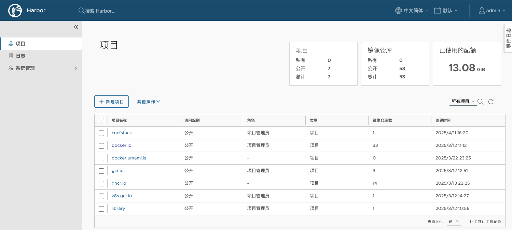

# ImageToTo

ImageToTo 是一种将不同位置的容器镜像同步到 [harbor.cncfstack.com](https://harbor.cncfstack.com) 的方案，以加速在中文场景下的镜像获取。

若有需要的拉取镜像，可以提交 PR ，合并后即可同步拉取。

对时效性要求高的话，可以添加 [藏云阁网站底部的好友](https://cncfstack.com)，高优先级处理。

